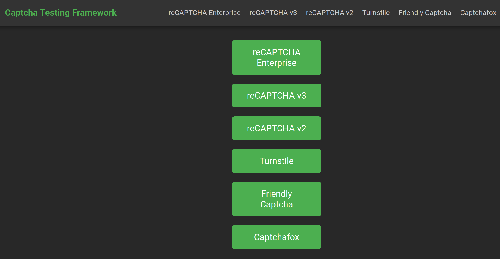

# Captcha Testing Framework

The Captcha Testing Framework is a website template that can be used to integrate CAPTCHAs. The following CAPTCHAs are included by default:

* reCAPTCHA Enterprise
* reCAPTCHA v3
* reCAPTCAH v2
* Cloudflare Turnstile
* Friendly Captcha
* Captchafox



## Requirements

Create a `.env` file with the following structure:

```bash
# Turnstile
TURNSTILE_SITE_KEY="YOUR_SITE_KEY"
TURNSTILE_SECRET_KEY="YOUR_SECRET_KEY"

# Friendly Captcha
FRIENDLY_CAPTCHA_SITE_KEY="YOUR_SITE_KEY"
FRIENDLY_CAPTCHA_SECRET_KEY="YOUR_SECRET_KEY"

# Recaptcha V2
RECAPTCHA_V2_SITE_KEY="YOUR_SITE_KEY"
RECAPTCHA_V2_SECRET_KEY="YOUR_SECRET_KEY"

# Recaptcha V3
RECAPTCHA_V3_SITE_KEY="YOUR_SITE_KEY"
RECAPTCHA_V3_SECRET_KEY="YOUR_SECRET_KEY"

# Recaptcha enterprise
RECAPTCHA_ENTERPRISE_SITE_KEY="YOUR_SITE_KEY"
RECAPTCHA_ENTERPRISE_SECRET_KEY="YOUR_SECRET_KEY"

# Captchafox
CAPTCHA_FOX_SITE_KEY="YOUR_SITE_KEY"
CAPTCHA_FOX_SECRET_KEY="YOUR_SECRET_KEY"
```

In order to change host and port add the following parameters

```bash
HOST="YOUR_HOST"
PORT="YOUR_PORT"
```

## Running

#### Option 1

```bash
cargo run
# or
cargo run --release
```

#### Option 2

```bash
sudo docker-compose up -d
```

#### Building the container

```bash
sudo docker build -t captcha-testing-framework .
```

When the app is running navigate to:

```
http://localhost:8080
